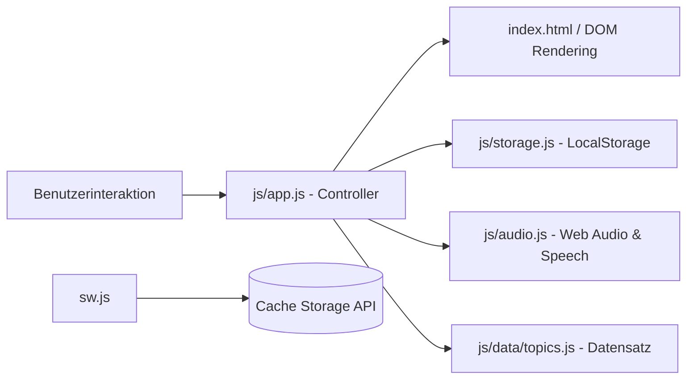

# Technische Architektur (Architecture Guide)

Dieses Dokument beschreibt die Architektur und Komponentenstruktur von **Deutschify**.

---

## 🏛️ Architekturüberblick

Deutschify ist als leichtgewichtige, frameworkfreie Webanwendung (Vanilla JavaScript ES-Module, HTML5, CSS3) nach den Prinzipien einer **Progressive Web App (PWA)** konzipiert. Alle Produktionsdateien liegen im Ordner `public/`, passend zur Bereitstellung über **Firebase Hosting**.

```text
public/
├── index.html           # Semantisches HTML-Grundgerüst & Einstiegspunkt
├── manifest.json        # PWA-Manifest (App-Metadaten, Farben, Icons)
├── sw.js                # Service Worker für Offline-Caching & PWA-Lifecycle
├── css/
│   └── style.css        # Zentrales Design-System (Dark/Light Mode, Glassmorphism)
├── icons/
│   └── icon.svg         # Vektorbasiertes App-Icon (SVG, skalierbar)
└── js/
    ├── app.js           # Haupt-Controller & View-Orchestrierung
    ├── storage.js       # LocalStorage-Persistenz (Fortschritt, Streak, Einstellungen)
    ├── audio.js         # Sound-Synthesizer (Web Audio API) & Sprachausgabe (Web Speech API)
    └── data/
        └── topics.js    # Statischer Übungs- und Themendatensatz
```

---

## 🔄 Datenfluss & Komponenten



### 1. Controller (`public/js/app.js`)
- Verwaltet den Anwendungszustand (`currentTopic`, `exerciseQueue`, `currentIndex`, `selectedAnswer`, `inputMode`).
- Steuert den Wechsel zwischen den Ansichten:
  - `view-topics`: Themenübersicht mit Lernstand je Kategorie
  - `view-exercise`: Interaktiver Lückentext mit Satzvorschau
  - `view-summary`: Rundenabschluss mit Trefferquote und Serie
- Reagiert auf Tastatureingaben (Tastenkombinationen `1`–`4`, `Enter` zum Prüfen/Weitergehen).
- Enthält eine leichtgewichtige 60fps-Canvas-Partikelanimation für Erfolgs-Momente.

### 2. Speicherverwaltung (`public/js/storage.js`)
- Speichert und aktualisiert den Benutzerfortschritt in `localStorage` unter dem Schlüssel `deutschify_state_v1`.
- Trackt:
  - Beantwortete Aufgaben (Gesamtanzahl, richtig, falsch)
  - Tägliche Serie (Streak) und automatische Überprüfung auf Serien-Kontinuität
  - Pro-Thema-Fortschritt (`completedIds`, Trefferquote)
  - Benutzereinstellungen (Farbschema, Toneffekte, bevorzugter Eingabemodus)

### 3. Audio & Sprachsynthese (`public/js/audio.js`)
- **Web Audio API (`SoundEffects`)**:
  - Erzeugt synthetische Klänge (Sinus-/Dreieck-Oszillatoren) direkt im Browser – keine Ladezeiten für externe MP3-Dateien.
  - Dreiklang-Akkord für korrekte Antworten, abfallende Tonfolge für Korrekturbedarf, Fanfare für Rundenabschluss.
- **Web Speech API (`SpeechService`)**:
  - Verwendet `window.speechSynthesis` mit automatischer Erkennung einer deutschen Stimme (`de-DE`).
  - Ermöglicht das Vorlesen ganzer Sätze oder einzelner Kollokationen zur Schulung des Hörverständnisses.

### 4. Offline & PWA (`public/sw.js` & `public/manifest.json`)
- Caching-Strategie:
  - Statische Kernressourcen (HTML, CSS, JS, Icons) werden beim `install`-Event im Cache `deutschify-v1` abgelegt.
  - Anfragen werden primär aus dem Cache bedient (Cache-first mit Hintergrundaktualisierung).
- Vollständige Offline-Funktionalität nach dem ersten Laden.
- Ermöglicht die direkte Installation auf Smartphones (iOS / Android) und Desktops ohne App-Store.
