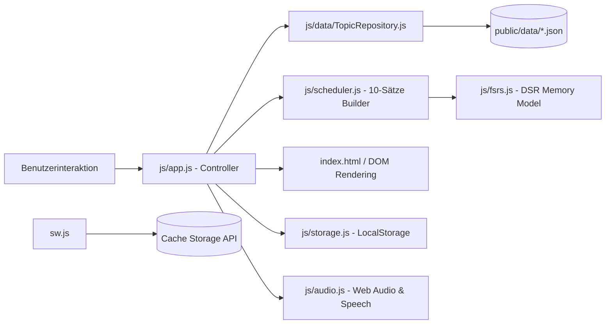

# Technische Architektur (Architecture Guide)

Dieses Dokument beschreibt die Architektur und Komponentenstruktur von **Deutschify**.

---

## 🏛️ Architekturüberblick

Deutschify ist als leichtgewichtige, frameworkfreie Webanwendung (Vanilla JavaScript ES-Module, HTML5, CSS3) nach den Prinzipien einer **Progressive Web App (PWA)** konzipiert. Alle Produktionsdateien liegen im Ordner `public/`, passend zur Bereitstellung über **Firebase Hosting**.

Code und Daten sind strikt voneinander getrennt:
- **Code (`public/js/`)**: Anwendungslogik, UI-Controller, Spaced Repetition (FSRS), Session Scheduler, Audio.
- **Daten (`public/data/`)**: Reine JSON-Dateien (Metadaten-Manifest und thematische Übungsdateien).

```text
public/
├── index.html           # Semantisches HTML-Grundgerüst & Einstiegspunkt
├── manifest.json        # PWA-Manifest (App-Metadaten, Farben, Icons)
├── sw.js                # Service Worker für Offline-Caching & PWA-Lifecycle
├── css/
│   └── style.css        # Zentrales Design-System (Dark/Light Mode, Glassmorphism)
├── icons/
│   └── icon.svg         # Vektorbasiertes App-Icon (SVG, skalierbar)
├── data/                # REINE DATEN (JSON)
│   ├── topics.json      # Themen-Manifest (Übersicht, Metadaten, Zähler)
│   └── topics/          # Modulare Themen-Inhalte
│       ├── kollokationen.json
│       ├── praepositionen.json
│       ├── nomen-praepositionen.json
│       ├── redewendungen.json
│       ├── adjektive.json
│       └── konjunktionen.json
└── js/                  # ANWENDUNGSCODE
    ├── app.js           # Haupt-Controller & View-Orchestrierung
    ├── fsrs.js          # FSRS Spaced-Repetition-Engine (DSR-Modell)
    ├── scheduler.js     # 10-Sätze-Session Builder & Anki Analytics Engine
    ├── storage.js       # LocalStorage-Persistenz (Fortschritt, Streak, FSRS)
    ├── audio.js         # Sound-Synthesizer (Web Audio API) & Sprachausgabe
    └── data/
        └── TopicRepository.js # Data Access Layer / Repository Service
```

---

## 🔄 Datenfluss & Komponenten


```mermaid
flowchart LR
    User[Benutzerinteraktion] --> App[js/app.js - Controller]
    App --> Repo[js/data/TopicRepository.js]
    Repo --> JSON[(public/data/*.json)]
    App --> Scheduler[js/scheduler.js - 10-Sätze Builder]
    Scheduler --> FSRS[js/fsrs.js - DSR Memory Model]
    App --> UI[index.html / DOM Rendering]
    App --> Storage[js/storage.js - LocalStorage]
    App --> Audio[js/audio.js - Web Audio & Speech]
    ServiceWorker[sw.js] --> Cache[(Cache Storage API)]
```

### 1. Datenzugriffsschicht (`public/js/data/TopicRepository.js`)
- Kapselt sämtliche Ladevorgänge für Lerndaten.
- Lädt das Manifest (`topics.json`) und Topic-Dateien parallel (`Promise.all`).
- Verwaltet einen In-Memory-Cache (`Map`), um wiederholte Netzwerkanfragen zu vermeiden.
- Bietet bequeme Aggregationsmethoden wie `getAllExercises()` für das tägliche Smart-Training und globale Statistiken.

### 2. Controller (`public/js/app.js`)
- Verwaltet den Anwendungszustand (`currentTopic`, `exerciseQueue`, `currentIndex`, `selectedAnswer`, `inputMode`).
- Steuert den Wechsel zwischen den Ansichten:
  - `view-topics`: Themenübersicht mit Lernstand je Kategorie
  - `view-exercise`: Interaktiver Lückentext mit Satzvorschau
  - `view-summary`: Rundenabschluss mit Trefferquote und Serie
- Reagiert auf Tastatureingaben (Tastenkombinationen `1`–`4`, `Enter` zum Prüfen/Weitergehen).
- Enthält eine leichtgewichtige 60fps-Canvas-Partikelanimation für Erfolgs-Momente.

### 3. Speicherverwaltung (`public/js/storage.js`)
- Speichert und aktualisiert den Benutzerfortschritt in `localStorage` unter dem Schlüssel `deutschify_state_v1`.
- Trackt:
  - Beantwortete Aufgaben (Gesamtanzahl, richtig, falsch)
  - Tägliche Serie (Streak) und automatische Überprüfung auf Serien-Kontinuität
  - Pro-Thema-Fortschritt (`completedIds`, Trefferquote)
  - Benutzereinstellungen (Farbschema, Toneffekte, bevorzugter Eingabemodus)

### 4. Audio & Sprachsynthese (`public/js/audio.js`)
- **Web Audio API (`SoundEffects`)**: Synthetische Klänge direkt im Browser ohne externe MP3-Ladezeiten.
- **Web Speech API (`SpeechService`)**: Deutsche Aussprache (`de-DE`) für Sätze und Kollokationen.

### 5. Offline & PWA (`public/sw.js` & `public/manifest.json`)
- Caching aller statischen Ressourcen inklusive sämtlicher JSON-Datensätze im Cache `deutschify-v3`.
- Vollständige Offline-Funktionalität nach dem ersten Laden.
